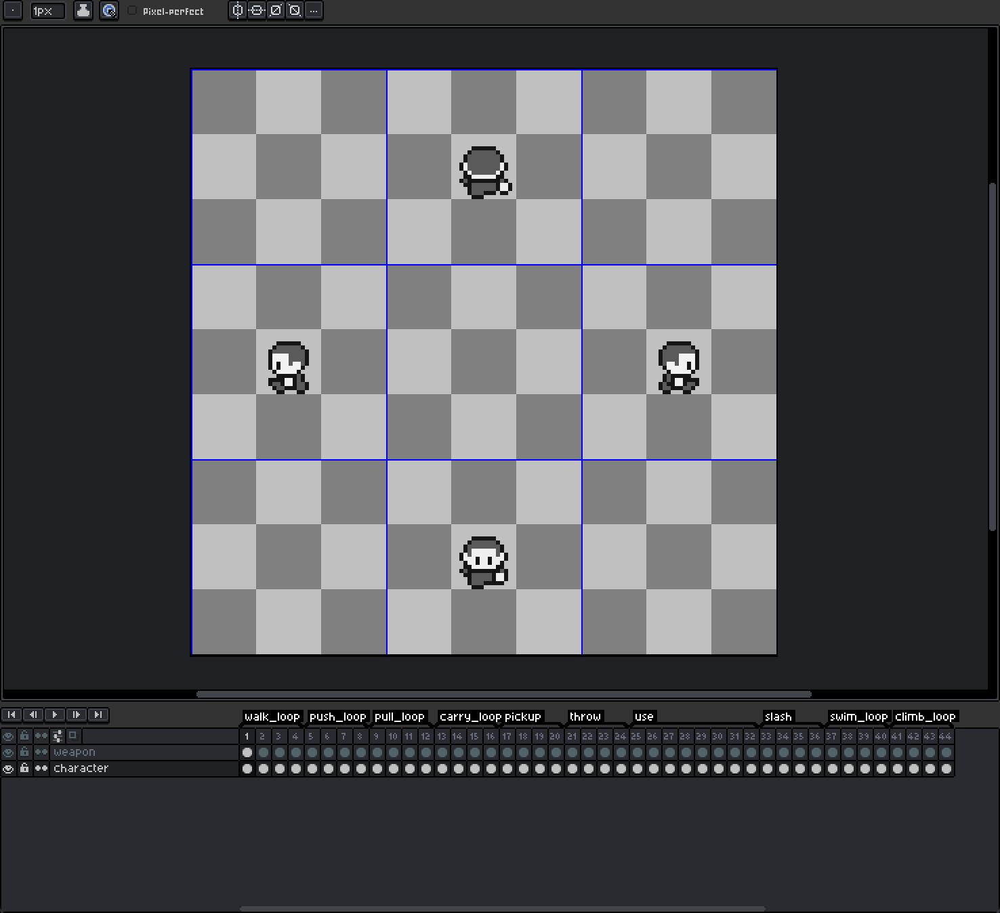
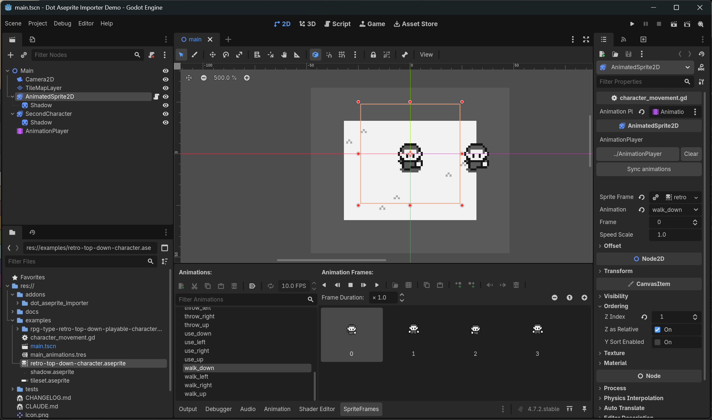

# Dot Aseprite Importer

[English](README.md) | **Português (Brasil)**

Um addon de editor para Godot 4.7 que importa arquivos `.aseprite` / `.ase` do jeito que estão: cada
arquivo vira um recurso **SpriteFrames** com uma animação por tag, com o tempo igual ao do Aseprite,
os frames empacotados numa folha só e nada exportado para o projeto. Atribua o arquivo a um
AnimatedSprite2D e, se quiser, vincule um AnimationPlayer que recebe as mesmas animações. Qualquer
`.aseprite` também pode ser importado como um **Texture2D** simples, para os sprites que não são
animados.

```
hero.aseprite (48x48)                      SpriteFrames (frames de 48x48)
  tags: idle_loop, run_loop, jump    ->      idle (loop), run (loop), jump
```

## Personagens top-down: uma grade 3x3 de direções

Um personagem que olha para cima, para baixo e para os lados pode ser desenhado num arquivo só, com
cada frame sendo uma grade 3x3 de direções. Com `grid/directions` em `3x3`, por arquivo ou para o
projeto inteiro em *Project Settings > Import Defaults*, cada tag gera uma animação por direção:

```
character.aseprite (144x192)              SpriteFrames (frames de 48x64)
  +-----------+------+------------+         idle_left_up, idle_up, idle_right_up,
  | left_up   | up   | right_up   |         idle_left_down, idle_down, idle_right_down,
  | left      |      | right      |  ->     walk_left_up, walk_up, ...
  | left_down | down | right_down |
  +-----------+------+------------+
  tags: idle_loop, walk, ...
```

Uma célula sem pixels em nenhum frame de uma tag não gera animação: um personagem desenhado em seis
direções (sem `left` e `right` puros) simplesmente deixa essas células vazias. Veja
[Personagens top-down](docs/pt-BR/top-down.md).

Os nomes de menus, painéis, docks, botões e opções aparecem como no editor em inglês.

## Screenshots

O personagem de exemplo, um personagem top-down, no Aseprite: cada frame é uma grade 3x3 de
direções (as guias em azul), com as células das diagonais vazias, uma tag por animação na timeline e
duas camadas.



O mesmo arquivo no Godot: as animações do SpriteFrames no painel de baixo e a seção
**AnimationPlayer** do inspetor do AnimatedSprite2D, à direita.



## Requisitos

- Godot **4.7** (testado com 4.7.1).
- [Aseprite](https://www.aseprite.org/) 1.3 com suporte a scripts (testado com 1.3.18). Todo mundo
  que importa os arquivos precisa dele.

## Instalação

1. Copie `addons/dot_aseprite_importer` para a pasta `addons/` do seu projeto.
2. Ative **Dot Aseprite Importer** em *Project > Project Settings > Plugins*.
3. Se o Aseprite não estiver no local padrão (uma instalação pela Steam, por exemplo), defina
   *Editor Settings > Dot Aseprite Importer > General > Executable Path* ou a variável
   de ambiente `ASEPRITE_PATH`. Veja
   [Executável do Aseprite](docs/pt-BR/importing.md#executável-do-aseprite).
4. Para pixel art nítida, defina *Project Settings > Rendering > Textures > Canvas Textures >
   Default Texture Filter* como **Nearest**.

## Início rápido

1. No Aseprite, desenhe os frames do personagem e crie uma tag para cada animação. Uma tag
   terminada em `_loop` (`run_loop`) fica em loop.
2. Salve o arquivo dentro do projeto Godot. Quando o editor do Godot recupera o foco, o arquivo é
   importado como SpriteFrames.
3. Arraste o arquivo para a propriedade **Sprite Frames** de um AnimatedSprite2D e reproduza uma
   animação: `$AnimatedSprite2D.play("run")`. Desenhe o personagem olhando para a direita e ative
   `flip_h` para ele olhar para a esquerda.
4. Se quiser, vincule um AnimationPlayer na seção **AnimationPlayer** do inspetor do sprite para ter
   as mesmas animações nele e adicionar suas próprias trilhas.

[Primeiros passos](docs/pt-BR/getting-started.md) mostra esses passos em detalhe, com um script de
movimento, e [Personagens top-down](docs/pt-BR/top-down.md) faz o mesmo para um personagem que olha
para oito lados.

## Documentação

- [Primeiros passos](docs/pt-BR/getting-started.md): de um arquivo vazio no Aseprite a um
  personagem que corre e pula, e o projeto de demonstração.
- [Personagens top-down](docs/pt-BR/top-down.md): a grade 3x3 de direções, como ativá-la para um
  projeto e como reproduzir a direção para a qual o personagem olha.
- [Desenhando o sprite](docs/pt-BR/drawing-the-sprite.md): camadas, tags e loops.
- [Importação](docs/pt-BR/importing.md): o executável do Aseprite, quando os arquivos são
  importados, as opções do dock Import e outros importadores de Aseprite.
- [AnimatedSprite2D](docs/pt-BR/animated-sprite-2d.md): nomes, velocidade e loops das animações.
- [AnimationPlayer](docs/pt-BR/animation-player.md): vincular um player, sincronização, suas
  próprias trilhas e o arquivo da biblioteca de animações.
- [Limitações conhecidas](docs/pt-BR/limitations.md)
- [Desenvolvimento](docs/pt-BR/development.md): testes, ferramentas e o asset de exemplo.

## Créditos

O personagem de exemplo é feito a partir do
["RPG Type Retro Top-Down Playable Character Template" de 5yvalia](https://5yvalia.itch.io/rpg-type-retro-top-down-playable-character-template),
publicado como **CC0** (domínio público). As spritesheets estão em
`examples/rpg-type-retro-top-down-playable-character-spritesheett/`, com o `LICENSE.png` do
download.

## Licença

[MIT](LICENSE)
